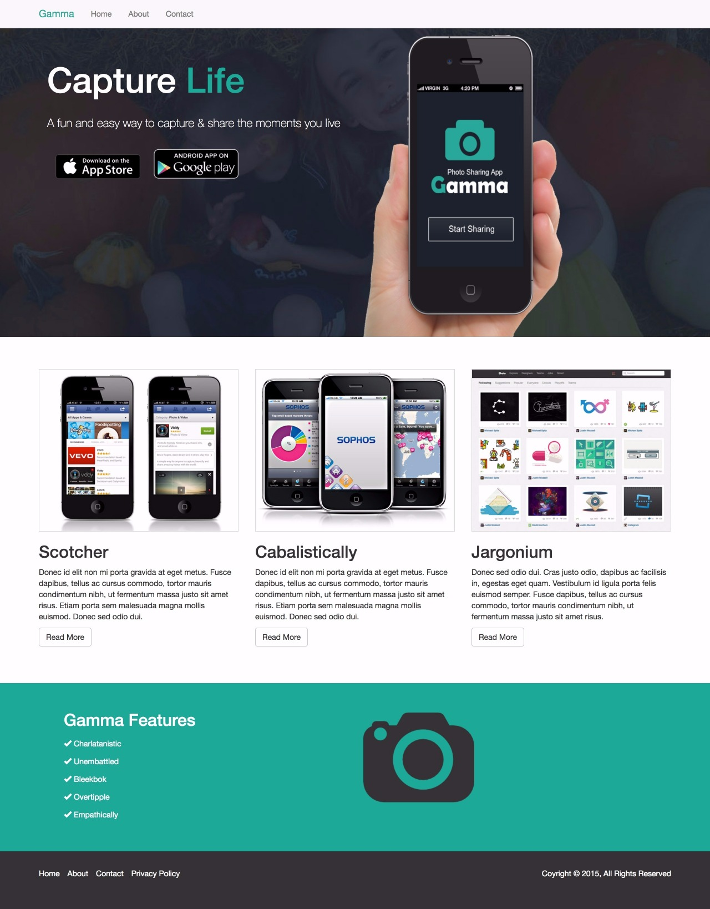

# [Photo App Website](https://marioterron.github.io/bootstrap-photoapp-website) #

## Description ##

This repository contains a bootstrap site made in the [Skylab Coders Academy](http://www.skylabcoders.com/es/)
Full Stack Web Development Bootcamp.

[Here](https://github.com/juanmaguitar/bootstrap-exercises/tree/master/01-photoapp-website) you can see the description of the exercise and [here](https://marioterron.github.io/bootstrap-photoapp-website) you can follow my progress.

